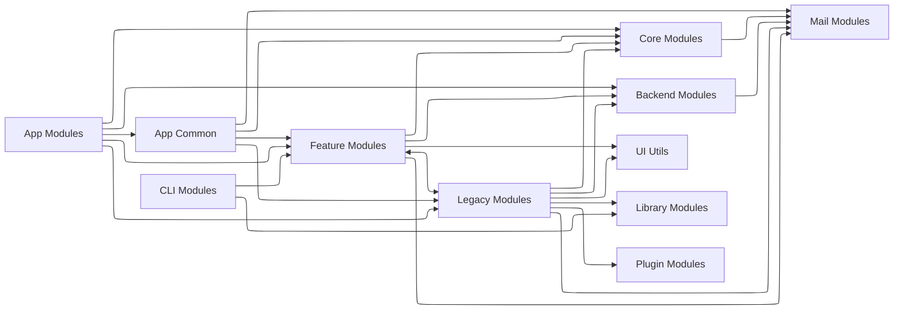
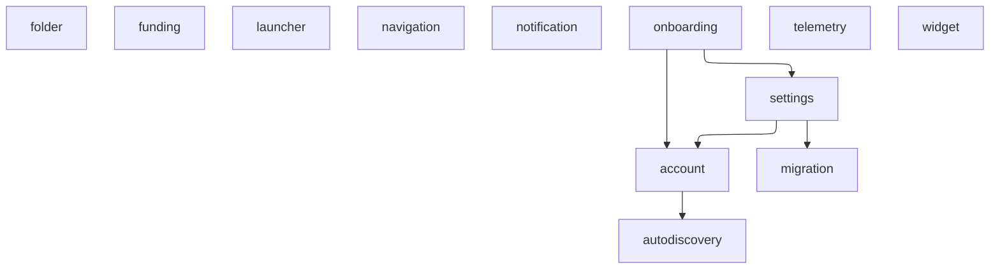

# Introduction

This document serves as an overview of Thunderbird Android's code base. It will analyze the project architecture and evaluate technical decisions and points of interest.

# Project Overview

[Thunderbird Android](https://github.com/thunderbird/thunderbird-android) is an Android mail client that allows users to manage multiple email accounts at once, including a unified inbox to collate all emails into one list. It is the successor to K-9 mail.


# Prerequisites

Working with this project requires prerequisite knowledge and installed software. Ensure having prior knowledge of the following:

- Kotlin and Java
- Android Activities and Fragments
- Jetpack Compose
- LiveData
- Kotlin Coroutines and Flow

The following software must also be available:

- IDE ([Android Studio](https://developer.android.com/studio) preferred)
- Git

# Building the Project

## Checkout the project

The project may be checked out via GitHub CLI or any Git GUI

### GitHub CLI

`$ gh repo clone thunderbird/thunderbird-android`

### Android Studio


# Project Structure
## Architecture


The most major modules to note are the App, Legacy, Feature, Backend and Core modules.

## App modules
The App modules, which serve as the entry points or highest level of the app architecture, depend on all other modules both directly and indirectly. They are responsible for defining which features are presented to the users and how the dependency tree is built.

`app-thunderbird` is the primary module for running the app, and contains all the features of the app alongside the Thunderbird theme. The `ThunderbirdApp` application class overrides from `CommonApp` defined in the `legacy.common` module and has additional telemetry initialization.

`app-k9mail` is a secondary module for running the app. It is the original K-9 Mail app, and has most of the features of the Thunderbird app with the main difference being the theme and lack of telemetry.

`app-ui-catalog` is a separate app purely to showcase the UI components used by both `app-thunderbird` and `app-k9mail`.

### Dependency Injection

The project uses [Koin](https://insert-koin.io/) to handle dependency injection, and takes a modular approach to creating the dependencies. The `app-thunderbird` module defines all the dependencies of the app, referencing Koin modules from other app modules such as `appCommonModule`, `featureModule`, etc., each of which define their own dependencies.

## Legacy modules
The Legacy modules are the original implementation of the app, with structure going as far back as using the previous Activity and Fragment with XML layouts (For example, `MessageList` with `MessageListFragment` and `message_list_fragment.xml`). Each feature is separated into its own submodule (e.g., `account`, `search`, etc.), but many of the modules are interdependent. This can result in changes to one deeply nested module having a cascading effect, requiring updates in multiple other modules. For example, an update to the `account` module may require `core` to update, leading to `testing`, `storage`, `ui base` and `common` all needing updates too.


## Feature modules
The Feature modules are an updated implementation of the apps features with focus on more modern code usage (e.g., Jetpack Compose instead of XML layouts), as well as more separation between features. The majority of the feature modules do not depdend on other features and thus can be worked on independently.



## Mail modules
The Mail modules are the most foundational modules of the app, responsible for handling mail messages and interacting with different email protocols.

## Backend modules
```
- Backend Modules implement protocol-specific functionality, relying only on Mail modules.
```
The Backend modules `TODO`

## Core modules
```
- Core Modules provide essential services used by nearly all other module groups.
```
The Core modules `TODO`

# Modules

## App

## App Common

## Feature

## Core

## Legacy

## Backend

## CLI

## Mail

## UI Utils

## Library

## Plugin

# Points of Interest

`>> TODO: discuss modules/class/files of note`
<br> `>> - Interesting code`
<br> `>> - Points to improve`
<br> `>> - Unusual designs`

**PreviewDevices**
</br>
Annotation class to collate multipe preview annotations into one, allowing previews to show their layouts on multiple devices from small phones up to desktop size screens.

**Legacy modules**
</br> 
Even though many of the modules are defined as *legacy* modules, they are still actively used in the app with no sign of deprecation. The main entry point of the app (`MessageList`) is located in the `legacy.ui.legacy` module. Many of the classes are also still written in Java.

**ResponsiveContent**
</br> 
Wrapper to adapt content to multiple screen sizes `TODO`

# Conclusion

`>> TODO: Summarize above content and draw conclusion`