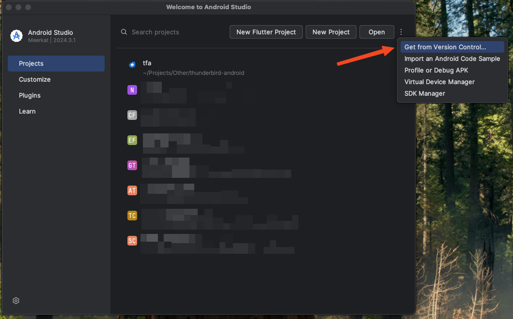

# Introduction
This document serves as an overview of Thunderbird Android's code base. It will analyze the project architecture and evaluate technical decisions and points of interest.

# Project Overview
[Thunderbird Android](https://github.com/thunderbird/thunderbird-android) is an Android mail client that allows users to manage multiple email accounts at once, including a unified inbox to collate all emails into one list. It is the successor to K-9 mail.


# Prerequisites
Working with this project requires prerequisite knowledge and installed software. Ensure having prior knowledge of the following:

- Kotlin and Java
- Android Activities and Fragments
- Jetpack Compose
- LiveData
- Kotlin Coroutines and Flow

The following software must also be available:

- IDE ([Android Studio](https://developer.android.com/studio) preferred)
- Git

# Building the Project

## Checkout the project
The project may be checked out via GitHub CLI or any Git GUI

### GitHub CLI

`$ gh repo clone thunderbird/thunderbird-android`

### Android Studio



# Project Structure

## Architecture


The most major modules to note are the App, Legacy, Feature, Backend and Core modules.

`TODO deeper dive into overall structure?`

# Modules

## App modules
The App modules, which serve as the entry points or highest level of the app architecture, depend on all other modules both directly and indirectly. They are responsible for defining which features are presented to the users and how the dependency tree is built.

`app-thunderbird` is the primary module for running the app, and contains all the features of the app alongside the Thunderbird theme. The `ThunderbirdApp` application class overrides from `CommonApp` defined in the `legacy.common` module and has additional telemetry initialization.

`app-k9mail` is a secondary module for running the app. It is the original K-9 Mail app, and has most of the features of the Thunderbird app with the main difference being the theme and lack of telemetry.

`app-ui-catalog` is a separate app purely to showcase the UI components used by both `app-thunderbird` and `app-k9mail`.

### App Common module
The purpose of this module according to the supplied README is to provide common functionality between the `app-thunderbird` and `app-k9mail` modules. However, the content of `app-common` is simply a DI setup of Account-related classes. It is possible this module may be expanded in the future, but given the current setup with the new Feature modules it may make more sense to move this DI setup to the `feature/account` module instead.

### Dependency Injection
The project uses [Koin](https://insert-koin.io/) to handle dependency injection, and takes a modular approach to creating the dependencies. The `app-thunderbird` module defines all the dependencies of the app, referencing Koin modules from other app modules such as `appCommonModule`, `featureModule`, etc., each of which define and supply their own abstractions/implementations.

## Legacy modules
The Legacy modules are the original implementation of the app, with structure going as far back as using the previous Activity and Fragment with XML layouts (For example, `MessageList` with `MessageListFragment` and `message_list_fragment.xml`). Each feature is separated into its own submodule (e.g., `account`, `search`, etc.), but many of the modules are interdependent. This can result in changes to one deeply nested module having a cascading effect, requiring updates in multiple other modules. For example, an update to the `account` module may require `core` to update, leading to `testing`, `storage`, `ui base` and `common` all needing updates too.


## Feature modules
The Feature modules are an updated implementation of the apps features with focus on more modern code usage (e.g., Jetpack Compose instead of XML layouts), as well as more separation between features. The majority of the feature modules do not depend on other features and thus can be worked on independently.


`TODO expand on features?`

## Mail modules
The Mail modules are the most foundational modules of the app, responsible for handling mail messages and interacting with different email protocols.

### Common
`mail.common` may be considered the single most foundational module of the app, providing a base on which to build higher level functionality. This module provides the following features:

#### Message Structure and Representation
Messages are built upon the abstract `Message` class whose structure is defined by `Part` (Representing different parts of a message such as headers and content type) and `Body` (Representing the message body). The foundational implementation of this abstraction is the `MimeMessage` class. This allows the project to support multiple message types such as `ImapMessage`, `Pop3Message`, `TestMessage`, etc. 


Addresses are also supported by the concrete `Address` class that allows defining an email address and a personal identifier or contact name.

Different states associated with messages are defined as well, such as `Flags` (e.g., Seen, Deleted, Draft), `FolderType` (e.g., Inbox, Outbox, Spam) and `MessageDownloadState` (e.g., Partial, Full).

#### MIME Processing
The app supports the MIME standard and provides many helper classes for handling this format.

#### Logging
Despite not being related to mail, this module also provides the `Logger` abstraction, to allow using different logger implementations in different environments (e.g., Timber and `System.out`).

#### 

### Protocols

The three sub-packages here provide protocol-specific implementations for three major email protocols: `IMAP`, `POP3` and `SMTP`.

`IMAP` is used for synchronization-based email access, meaning that all messages and their associated states are kept on the server. This module add support for synchronization via `RealImapFolder` and push notifications via `RealImapFolderIdler`.

`POP3` is used for download-based email access, meaning that all messages will be downloaded to the device.

`SMTP` is used for sending messages, and thus handles message transmission via `todo add class` as well as formatting and authentication via `todo add class` and `todo add class` respectively.

### Testing
This module provides utilities and helper classes to assist with testing mail related components. Among the many classes, we can note the following key functionalities:

**Test Message Creation**
</br>
The module provides both a mock message implementation `TestMessage` as well as builders and DSLs (`TestMessageBuilder` and `buildMessage()`) for creating test messages.

**Mail-Specific Testing Tools**
</br>
Custom assertions for email objects are provided in `MessageExtensions` with the aim of simplifying the tests. String helper utilities are also provided in the base package to handle linebreaks in messages.

**Security Testing Support**
</br>
Mock implementations of security components are provided to test different security scenarios, such as `VeryTrustingTrustManager` which allows all certificates to pass through and `FakeTrustManager` which conditionally allows a certificate based on a flag. 

## Backend modules
```
- Backend Modules implement protocol-specific functionality, relying only on Mail modules.
```
The Backend modules `TODO`

## Core modules
```
- Core Modules provide essential services used by nearly all other module groups.
```
The Core modules `TODO`

## Other Modules 

### Core
`TODO`

### CLI
`TODO`

### UI Utils
`TODO`

### Library
`TODO`

### Plugin
`TODO`

# Points of Interest

**Kotlin/Java**
</br>
The project contains a mixture of both Kotlin and Java code, most notably in older modules such as `legacy` and `mail`. As per the [project wiki](https://github.com/thunderbird/thunderbird-android/wiki/CodeStyle#java), all new code is to be written in Kotlin. However, it seems that the migration from Java to Kotlin is done sporadically whenever a contributor works on an issue.

**App Common**
</br>
As mentioned above, despite serving as a "common" point between the main app modules, all the code in this module could be migrated to the `feature/account` module instead, rendering this module redundant.

**Legacy modules**
</br> 
Even though many of the modules are defined as *legacy* modules, they are still actively used in the app with little to no sign of deprecation. The main entry point of the app (`MessageList`) is located in the `legacy.ui.legacy` module.

**Logger**
</br>
The projects provides an interface `Logger` as an abstraction for it's logging purposes. Many projects make use of `Timber`, but this does not work on non-Android modules. The `Logger` interface allows the project to supply different logging implementations to work around this issue, such as `SystemOutLogger`. There is also a fake `Timber` object whose purpose is to temporarily handle the logging with the minimal amount of code change (i.e., updating only the import on relevant files) until Timber supports non-Android classes, but this seems unlikely as the project hasn't had any feature updates [since 2021](https://github.com/JakeWharton/timber/releases).

**RealImapFolderIdler**
</br>
This class implements IMAP's IDLE command, which is a feature that defines how real-time notifications are received by the client. The general flow of the logic is as follows:


**PreviewDevices**
</br>
Annotation class to collate multipe preview annotations into one, allowing previews to show their layouts on multiple devices from small phones up to desktop size screens. `TODO expand on benefits`

**ResponsiveContent**
</br> 
Wrapper to adapt content to multiple screen sizes `TODO expand on benefits`

# Conclusion

`>> TODO: Summarize above content and draw conclusion`


a

a

a

a

a

a

a

a

a

a

a

a

a

a

a

a

a

a

a

a

a

a

a

a